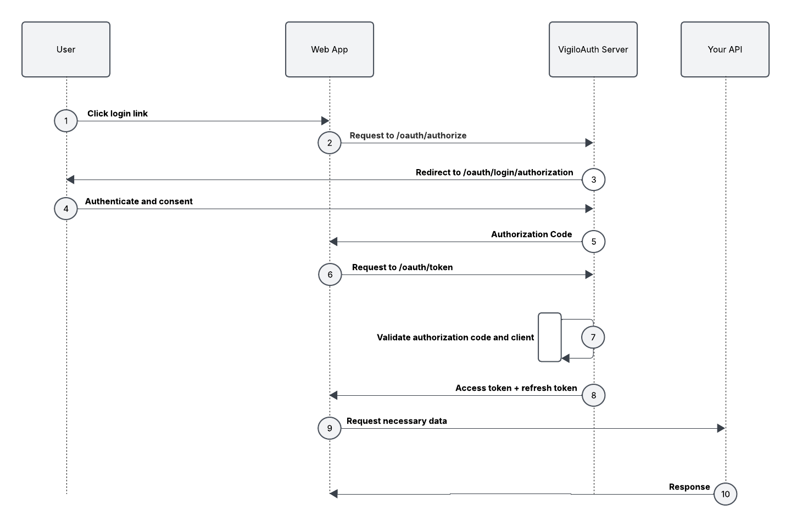

# Authorization Code Flow

## Table of Contents
- [Authorization Code Flow](#authorization-code-flow)
  - [Table of Contents](#table-of-contents)
  - [1. Introduction](#1-introduction)
      - [Key Features](#key-features)
  - [2. How the Authorization Code Flow works](#2-how-the-authorization-code-flow-works)
  - [3. Security Considerations](#3-security-considerations)
  - [4. Prerequisites](#4-prerequisites)
  - [4. References and Further Reading](#4-references-and-further-reading)

---

## 1. Introduction
The **Authorization Code Flow** is one of the most secure and widely used OAuth 2.0 flows. It is designed for:

- **Confidential Clients:** Applications that can securely store client secrets, such as server-side web applications.
- **Public Clients:** Applications that cannot securely store client secrets, such as mobile apps and single-page applications, when used with **PKCE (Proof Key for Code Exchange)**.

This flow makes sure that sensitive tokens are never exposed to the user's browser or client-side code, making it ideal for both types of clients. By leveraging PKCE, public clients can securely use the Authorization Code Flow without requiring a client secret.

The VigiloAuth Server provides full support for the Authorization Code Flow, allowing developers to easily integrate OAuth 2.0 authentication and authorization into their applications. It handles all key aspects of the flow, including:

- **Authorization Request:** Redirecting users to the authorization server with the required parameters.
- **User Consent:** Managing user consent for requested scopes.
- **Authorization Code Validation:** Validating the authorization code and making sure it matches the client and redirect URI.
- **Token Exchange:** Exchanging the authorization code for access and refresh tokens securely.
- **PKCE Support:** Improving security for public clients by preventing authorization code interception attacks.

By using the VigiloAuth library, developers can focus on building their applications while relying on robust implementations of the Authorization Code Flow that adheres to OAuth 2.0 best practices.

---

#### Key Features
- **Secure Token Handling:** Ensures that tokens are never exposed to the user's browser or client-side code.
- **PKCE Support:** Provides additional security for public clients by preventing authorization code interception attacks. 
- **Customizable:** Allows developers to configure client credentials, redirect URIs, and scopes to suit their application's needs.
- **Error Handling:** Includes detailed error responses for invalid requests, mismatched redirect URIs, invalid client credentials, etc.

To learn more about how the VigiloAuth library supports PKCE, please read the following documentation:
- [OAuth 2.0 Authorization Code Flow with PKCE](authorization_code_pkce.md)
- [Authorization Code Flow Endpoint](../endpoints/authz_handler/authorize_client.md)

---

## 2. How the Authorization Code Flow works

The Authorization Code FLow consists of the following key steps:

**1. User Login:**
  - If the user is not already authenticated, VigiloAuth server will return an error containing the login url.
    - `client_id`
    - `redirect_uri`
    - `scope`
    - `state` (generated by the VigiloAuth server)
  - If the user is already authenticated, this step is skipped.

**2. Authorization Request:**
  - After successful authentication, the client application redirects the user to the VigiloAuth endpoint with the required parameters, such as:
    - `client_id`
    - `redirect_uri`
    - `scope`
    - `response_type`

**3. User Consent:**
  - The user reviews and approves (or denies) the requested scopes.
  - If approved, VigiloAuth generates an **authorization code**.

**4. Redirect with Authorization Code:**
  - VigiloAuth redirects the user back to the client's application `redirect_uri`, appending the authorization code and state parameter.

**5. Token Exchange:**
  - The client application sends the authorization code to the token [endpoint](../endpoints/authz_handler/token_exchange.md) along with:
    - `client_id`
    - `redirect_uri`
    - `scope`
    - `response_type`
    - `state`
    - `client_secret` (if confidential)
    - Optional `code_verifier` (if PKCE is used)
  - VigiloAuth validates the request and issues an **access token** along with a **refresh token**

**6. Access Protected Resources:**
  - The client application uses the access token to make authorizes requests to protected resources.

---

## 3. Security Considerations
The Authorization Code Flow is designed to be secure, but improper implementation can lead to vulnerabilities. Below are key security considerations and how the VigiloAuth library addresses them:

**1. Authorization Code Interception**
- **Risk:** An attacker intercepts the authorization code during the redirect from the authorization server to the client.
- **Mitigation:**
  - Use **PKCE (Proof Key for Code Exchange)** for public clients (e.g., mobile apps, SPAs). PKCE ensures that the authorization code can only be exchanged by the client that initiated the request.
  - Always use HTTPS to encrypt communication between the client and the authorization server.

---

**2. Redirect URI Manipulation**
- **Risk:** An attacker manipulates the redirect_uri to redirect the authorization code to a malicious endpoint.
- **Mitigation:**
  - The VigiloAuth library validates the `redirect_uri` against the registered URIs for the client during the authorization request.
  - Make sure that the `redirect_uri` provided in the token exchange matches the one used during the authorization request.

---

**3. CSRF (Cross-Site Request Forgery)**
- **Risk:** An attacker tricks the user into authorizing a malicious request.
- **Mitigation:**
  - The VigiloAuth library automatically generates a unique and unpredictable `state` parameter during the consent process if the user is not logged in.
  - The `state` parameter is included in the login URL and echoed back to the client during the redirect, allowing the client to validate it.
  - Developers should ensure that the `state` parameter is also validated on the client side to prevent CSRF attacks.

---

**4. Token Leakage**
- **Risk:** Access tokens or refresh tokens are exposed to unauthorized parties.
- **Mitigation:**
  - Tokens are never exposed to the user's browser or client-side code in the Authorization Code Flow.
  - VigiloAuth uses secure storage mechanisms (e.g., encrypted storage) to store tokens.
  - Set short expiration times for access tokens and use refresh tokens to obtain new ones.
  - The default expiration time of access tokens is *30 minutes*, and for refresh tokens it is *30 days*. To learn more about configuring the token duration, please read the token configuration [documentation](../../configuration.md).

---

**5. Client Credential Exposure**
- **Risk:** Confidential client credentials (e.g., client_secret) are exposed.
- **Mitigation:**
  - Only use `client_secret` with confidential clients.
  - Public clients MUST use `PKCE` instead of `client_secret`.

---

**6. Replay Attacks**
- **Risk:** An attacker reuses an intercepts authorization code or token.
- **Mitigation:**
  - Authorization codes are single-use and expire after a short period of time.
  - VigiloAuth immediately revokes the authorization code if any error is encountered during the authorization process.
  - VigiloAuth makes sure that tokens are bound to the client and cannot be reused by unauthorized parties.

---

**7. Use of HTTPS**
- **Risk:** Communication between the client and the authorization server is intercepted.
- **Mitigation:**
  - Always use HTTPS to encrypt all communication between the client, authorization server, and resource server.
  - To learn more about configuring the server to use HTTPS, please read the server configuration [documentation](../../configuration.md).

---

**8. Scope Restriction**
- **Risk:** A client requests excessive permissions, leading to over-privileged access.
- **Mitigation:**
  - The VigiloAuth library enforces strict scope validation, making sure that clients can only request scopes they are authorized to access.
  - Developers should present the user with a clear list of requested scopes during the consent process.

---

**9. Refresh Token Security**
- **Risk:** Refresh tokens are stolen and used to obtain new access tokens.
- **Mitigation:**
  - Use refresh tokens only in secure environments (e.g., server-side applications).
  - VigiloAuth rotates refresh tokens after each use to limit their exposure.

---

## 4. Prerequisites
Before using the Authorization Code Flow with the VigiloAuth library, make the following prerequisites are met:

**1. Client Registration:**
- The client application must be registered with the VigiloAuth server.
- During the registration process, VigiloAuth generates:
  - `client_id`
  - `client_secret` (for confidential clients)
- The `client_id` and `client_secret` must be securely stored by the client application.

**2. Redirect URI Registration:**
- The `redirect_uri` must be registered with the VigiloAuth server during client registration.
- The `redirect_uri` provided during the authorization server request must match one of the registered URIs.
- Make sure that the `redirect_uri` uses HTTPS to secure communication.

**3. PKCE (Proof Key for Code Exchange):**
- For public clients, PKCE must be implemented to enhance security.
- The client must generate a `code_verifier` and a `code_challenge` before the authorization request.

**4. HTTPS Configuration:**
- All communication between the client, VigiloAuth server, and resource server must use HTTPS to prevent interception of sensitive data.
- Refer to the server configuration documentation for instructions enabling HTTPS.

**5. State Parameter Handling:**
- The VigiloAuth library automatically generates and validates the `state` parameter to prevent CSRF attacks.
- Developers do not need to manually generate or manage the `state` parameter.

**6. Scope Definition:**
- Define the scopes required by your application during client registration.
- Ensure that the requested scopes are appropriate for the resources your application needs to access.

**7. User Authentication:**
- The VigiloAuth server requires users to authenticate before granting authorization.
- To learn more about how VigiloAuth handles user authentication, refer to the user authentication documentation.

---

## 4. References and Further Reading
- [OAuth 2.0 Authorization Code Flow with PKCE](authorization_code_pkce.md)
- [Authorization Code Flow Endpoint](../endpoints/authz_handler/authorize_client.md)
- [Token Exchange Endpoint](../endpoints/authz_handler/token_exchange.md)
- [Proof Key for Code Exchange by Public Clients](https://datatracker.ietf.org/doc/html/rfc7636#section-3.1)
- [OAuth Login](../endpoints/oauth_handler/user_authentication.md)
- [Server Configuration](../../configuration.md)
- [User Authentication](../endpoints/oauth_handler/user_authentication.md)